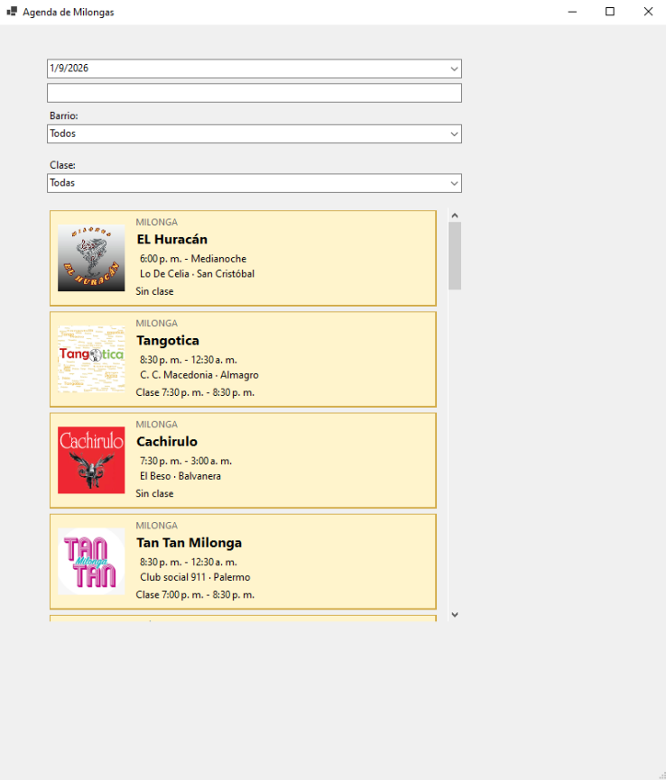
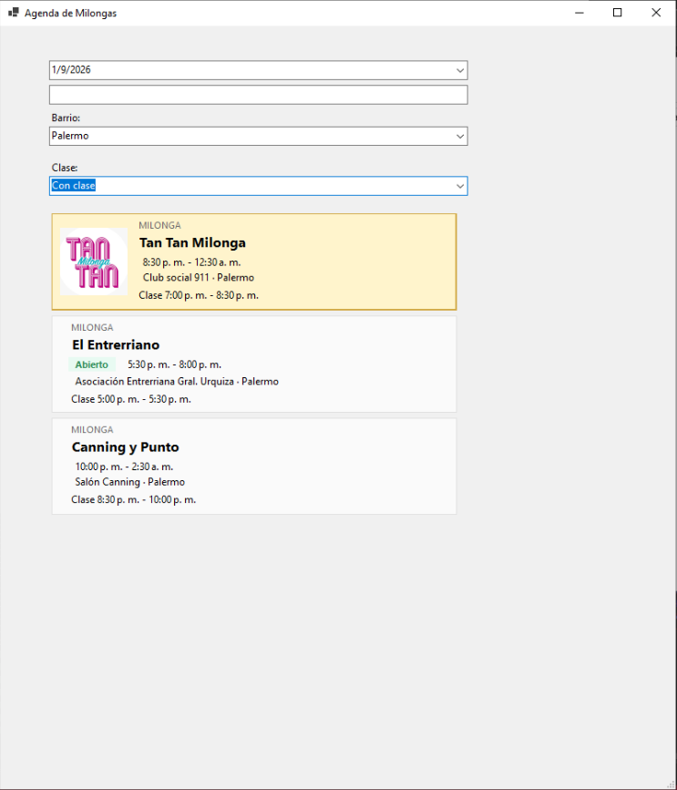
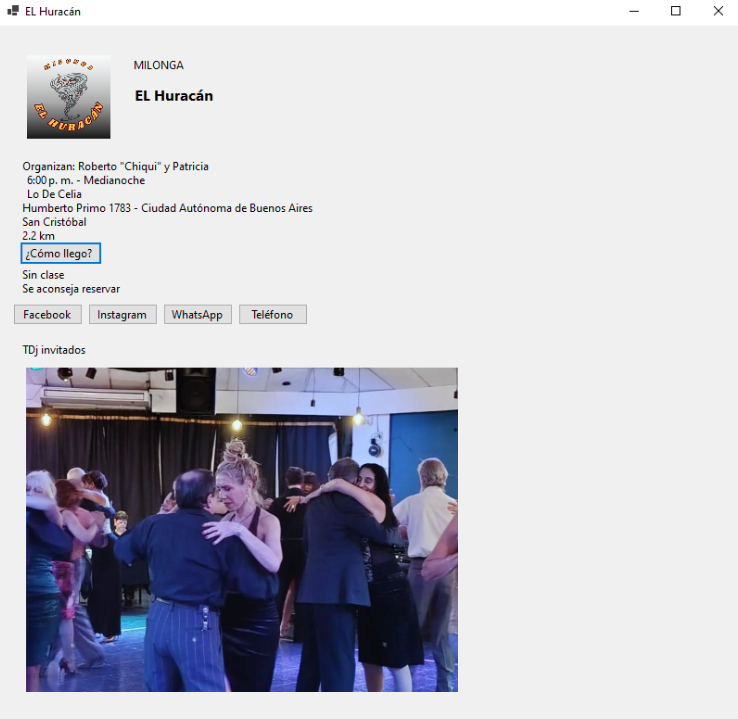

# Agenda de Milongas de Buenos Aires

Aplicación de escritorio desarrollada en C# y .NET 8 para consultar, filtrar y explorar la agenda de milongas de Buenos Aires.

La aplicación obtiene información pública desde Hoy Milonga, procesa los eventos disponibles y los presenta en una interfaz WinForms con carga progresiva, filtros, cálculo de distancias y vistas de detalle.

## Capturas

### Agenda



### Filtros



### Detalle de una milonga



## Funcionalidades

- Carga progresiva de la agenda.
- Navegación por fechas disponibles.
- Búsqueda por nombre, salón o barrio.
- Filtro por barrio.
- Filtro por eventos con o sin clase.
- Ordenamiento por horario o distancia.
- Identificación de eventos destacados, abiertos, finalizados y cancelados.
- Visualización de modalidad de entrada y eventos especiales.
- Vista detallada de cada milonga.
- Extracción de dirección, coordenadas, organizadores, descripción, contactos, imágenes y mapa.
- Caché local de detalles para reducir navegaciones repetidas y mejorar los tiempos de carga.
- Precarga de datos de los días siguientes.
- Manejo asincrónico de operaciones y cancelación de búsquedas anteriores.

## Tecnologías

- C#
- .NET 8
- Windows Forms
- Microsoft Playwright
- HtmlAgilityPack
- System.Text.Json

## Arquitectura

La solución está dividida principalmente en dos proyectos:

### Milongas.App

Aplicación WinForms responsable de la interfaz de usuario.

Incluye:

- listado de milongas;
- tarjetas de eventos;
- filtros;
- búsqueda;
- vista de detalle;
- estados de carga;
- interacción del usuario.

### Milongas.Extractor

Biblioteca de clases responsable de obtener, procesar y organizar los datos.

Incluye:

- navegación con Playwright;
- extracción de HTML;
- parsing con HtmlAgilityPack;
- modelos;
- filtros;
- cálculo de distancias;
- caché de detalles.

## Flujo general

```text
Hoy Milonga
    ↓
BrowserService / Playwright
    ↓
HtmlExtractor
    ↓
HoyMilongaService
    ↓
AgendaService / DistanciaService
    ↓
Milongas.App
```

La agenda se obtiene progresivamente. El primer día puede mostrarse antes de completar la carga del resto, mientras los siguientes eventos se procesan y precargan.

## Desafíos técnicos

Durante el desarrollo se abordaron varios problemas relacionados con la obtención y procesamiento de datos dinámicos:

- **Carga progresiva:** la agenda se procesa por día para poder mostrar resultados antes de finalizar la carga completa.
- **Contenido dinámico:** Playwright permite navegar e interactuar con el sitio antes de procesar el HTML con HtmlAgilityPack.
- **Carga de detalles:** la información disponible únicamente en la página individual de cada evento se obtiene bajo demanda y se precarga cuando es posible.
- **Caché local:** determinados datos de detalle se almacenan localmente para evitar navegaciones repetidas y reducir los tiempos de carga.
- **Concurrencia y asincronismo:** las operaciones de navegación y actualización de la interfaz se coordinan de forma asincrónica para mantener la aplicación responsiva.
- **Búsqueda con debounce:** las búsquedas de texto esperan brevemente antes de actualizar los resultados, evitando reprocesar la agenda por cada tecla presionada.

## Distancias

La aplicación calcula distancias utilizando coordenadas geográficas y la fórmula de Haversine.

Actualmente el punto de origen se encuentra configurado temporalmente con las coordenadas del Obelisco de Buenos Aires.

Una evolución futura del proyecto contempla utilizar la ubicación real del usuario.

## Caché

Los datos de detalle que resultan costosos de obtener se almacenan localmente en:

```text
detalles-cache.json
```

Este archivo se genera en tiempo de ejecución y no forma parte del repositorio.

## Ejecución

### Requisitos

- Windows
- .NET 8 SDK
- Visual Studio 2022 o compatible

Después de clonar el repositorio:

1. Abrir la solución en Visual Studio.
2. Restaurar los paquetes NuGet.
3. Asegurarse de que `Milongas.App` sea el proyecto de inicio.
4. Compilar la solución.
5. Ejecutar la aplicación.

Playwright necesita Chromium instalado para funcionar.

Si fuera necesario, instalar los navegadores de Playwright utilizando el script generado durante la compilación.

## Limitaciones actuales

- La aplicación depende de la estructura HTML de Hoy Milonga, por lo que cambios en el sitio pueden requerir actualizar los selectores.
- La ubicación del usuario todavía no se obtiene automáticamente.
- La versión actual está desarrollada como aplicación de escritorio para Windows.
- La carga de datos depende de la disponibilidad y los tiempos de respuesta del sitio fuente.

## Próximos pasos

Entre las posibles evoluciones del proyecto se encuentran:

- backend con ASP.NET Core Web API;
- extracción centralizada del lado servidor;
- persistencia en base de datos;
- geolocalización real del usuario;
- cliente web o móvil;
- soporte para Android e iOS;
- tests automatizados;
- logging estructurado.

## Estado

Proyecto en desarrollo activo.

La versión actual funciona como MVP de escritorio y está siendo preparada para portfolio.